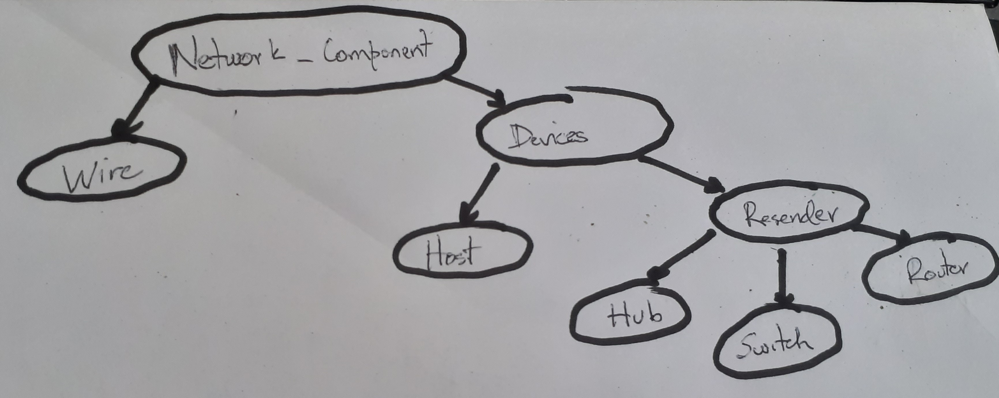

# Documentación de los dispositivos

Para modelar los dispositivos se tiene la siguiente jerarquía de clases:


La clase abstracta `Network_Component` representa todos los componentes en la red, entiéndase cualquier ente u objeto que pertenezca a la red.

Los dispositivos de la red, entiéndase objetos capaces de comunicarse. Se representan con la clase `Device` de la que heredan `Host` que representa los dispositivos capaces de enviar información durante la red. De la clase `Device` también hereda `Resender` que representa los dispositivos que son capaces de recibir y replicar información; entre estos está `Hub` y `Switch`.

El `Switch` es un componente de la red el cual permite enviar información a un host en específico, si el Switch conoce su MAC. Para aprender la MAC el Switch aprende como sigue:

* Host A envía a B, el switch almacena la MAC de A y el puerto donde está conectado. La información de A, se envía a todos los puertos del switch. B envía una información a C, y el switch almacena su MAC y el puerto donde está conectada.
* Cuando otro host D envía una información a B, el switch conoce dónde está conectado el host destino (B), por tanto, solo envía el dato por ese puerto.

## Clase `Logger` 

La clase `Logger` almacena un archivo de texto que es el registro del dispositivo que contiene la instancia de esta clase. Al escribir en el registro siempre utiliza la siguiente sintaxis:

```
<current_time> <message>
```

Para obtener el `current_time`, la clase tiene un `EventHook` que pide dicho dato.