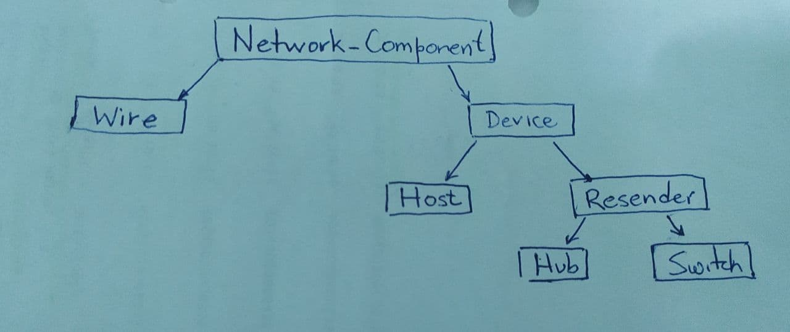

# Documentación de los dispositivos

Para modelar los dispositivos se tiene la siguiente jerarquía de clases:



La clase abstracta `Device` representa todos los dispositivos en la red, la variable `name` almacena el nombre del mismo, la lista `ports` almacena todos los puertos a los que está conectado, `read_value` es el valor que está leyendo, `receive_port` es el nombre del puerto por el que lo recibe, y `logger` es una entidad encargada de escribir en el archivo de registro del dispositivo.

El Switch es un componente de la red el cual permite enviar información a un host en específico, si el Switch conoce su MAC. Para aprender la MAC el Switch aprende como sigue:

* Host A envía a B, el switch almacena la MAC de A y el puerto donde está conectado. La información de A, se envía a todos los puertos del switch. B envía una información a C, y el switch almacena su MAC y el puerto donde está conectada.
* Cuando otro host D envía una información a B, el switch conoce dónde está conectado el host destino (B), por tanto, solo envía el dato por ese puerto.

## Clase Logger 

La clase `Logger` almacena un archivo de texto que es el registro del dispositivo que contiene la instancia de esta clase. Al escribir en el registro siempre utiliza la siguiente sintaxis:

```
<current_time> <message>
```

Para obtener el `current_time`, la clase tiene un `EventHook` que pide dicho dato.