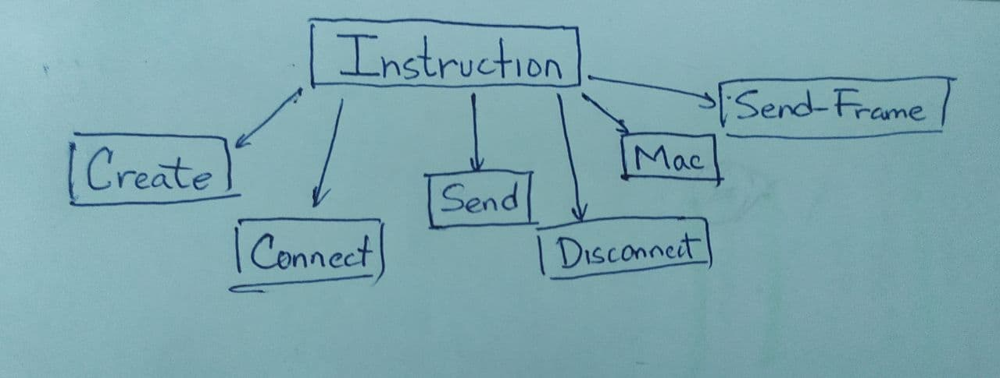

# Documentación de `Instructions` e `InstructionFactory`

Para la modelación de las instrucciones se tiene la siguiente jerarquía de clases:

Donde `Instruction` es una clase abstracta que tiene un método abstracto `.execute()`, el cual levanta el evento encargado de llevar a cabo la acción de la instrucción.

Cada clase heredera de Instruction almacena además los datos necesarios para su ejecución por ejemplo, la instucción `Send` almacena el nombre del dispositivo que debe enviar, y los datos a enviar.

Además, `Instruction` tiene un método estático que devuelve la instancia de una instrucción, utiliizando el patrón de diseño Factory. Para ello se tiene una jerarquía igual a la anterior con clases Factory's.

