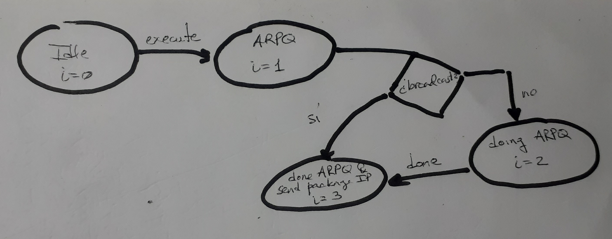

# Capa de Red

---

## Subred 

Se tiene un diccionario en la simulación que tiene cada ip de subred y los dispositivos que pertenecen a esa subred. Por ejemplo: si el dispositivo `pc` tiene `IP = 192.168.1.2`, entonces se realiza un `AND` entre su `IP` y su máscara el resultado obtenido es la subred a la que pertenece dicho dispositivo.

---

## Envio de paquetes IP

Para enviar paquete IP se tiene una máquina de estados que primero pregunta por la MAC del destino, utilizando el protocolo ARPQ. Cuando obtiene la respuesta ARPR envia el paquete IP. En caso de que se desee hacer un broadcast en la subred entonces no se realiza ARPQ sino que se asigna la MAC `FFFF`, y se procede a enviar el paquete.

A continuación se presenta la máquina de estados:

---

## Router

Se añade un nuevo dispositivo en esta capa bajo el nombre de `Router`, el cual es el encargado de enviar paquetes entre distintas subredes.

Un `Router` hereda de la clase `Resender` (Para ver la jerarquía de clases de los componentes de la red siga [el enlace](devices.md). Cuando un `Router` recibe un paquete IP, revisa si es un ARPQ o ARPR, si es alguno de estos lo deja pasar (lo cual significa que el lo vuelve a enviar), si es un broadcast entonces no se reenvía.

---

## Tabla de rutas

Las tablas de rutas se implementaron utilizando la estructura de datos `SortedSet` de la librería `sortedcontainers`. La cual mantiene un conjunto de elementos ordenados. La operación de inserción tiene costo logarítmico.

Para representar las rutas se hizo una clase `Route` que tiene como campos los elementos necesarios como:

- IP de destino
- Máscara
- Gateway
- Interface

La tabla de rutas y las rutas se implementaron en el archivo `src/route_table.py`.

Para calcular la prioridad de las rutas se asocia a cada ruta un entero que representa la prioridad, donde 1 es la mayor prioridad y 255 la menor. 